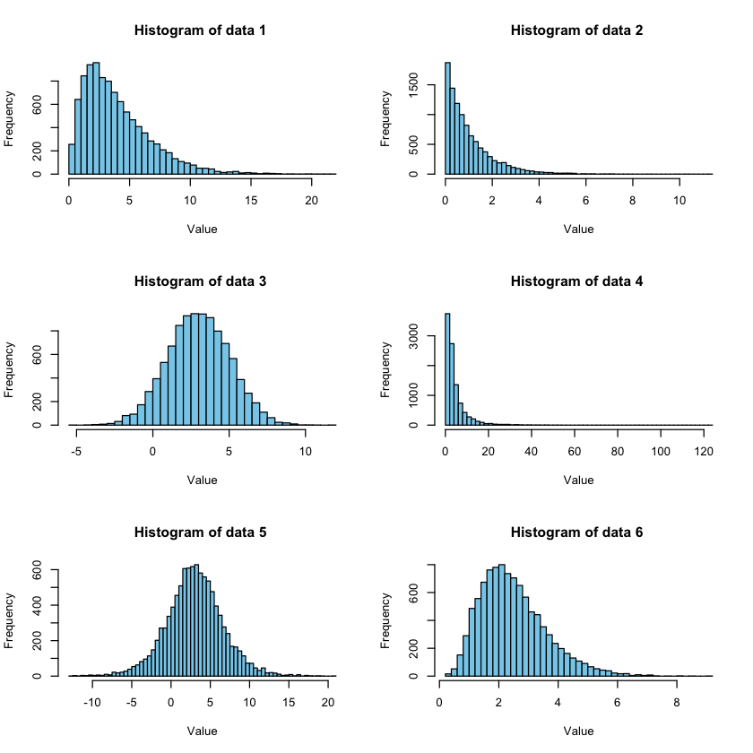

## Objective : To figure out what distribution does an input data most likely follow

We have 6 data, consisting of 10,000 numbers each, stored in a .csv file. We try to figure out which of the following distributions does the input data most likely follow:
1. Normal
2. Student's t
3. Chi-squared
4. Lognormal
5. Exponential
6. Gamma
7. Logistic

Here are the steps to figure out what distribution do they most likely follow:
1. Draw histograms to get better visualization
2. Use Fisher's max likelihood method


```R
# 1. Draw histograms to get better visualization
dataset = read.csv('dataset.csv', header=TRUE)

opar = par(mfrow = c(3,2))
for (col in 1:ncol(dataset)) {
    data = dataset[,col]
    hist(data, col="skyblue", breaks=50, main=paste("Histogram of data",col, ""), xlab="Value")
}
```




